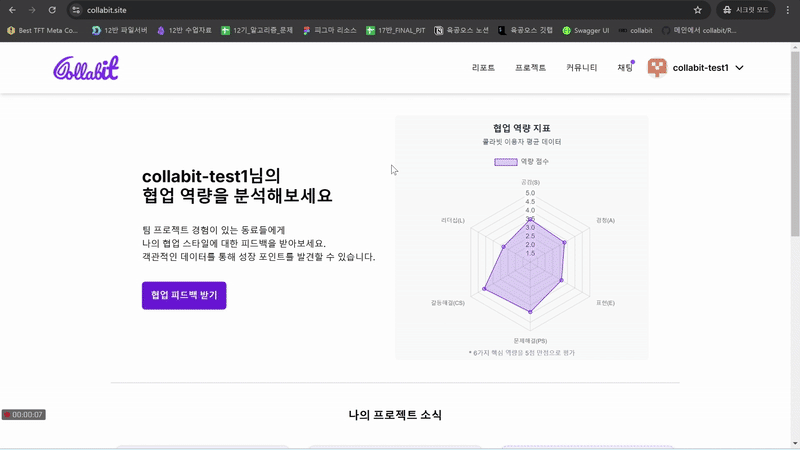
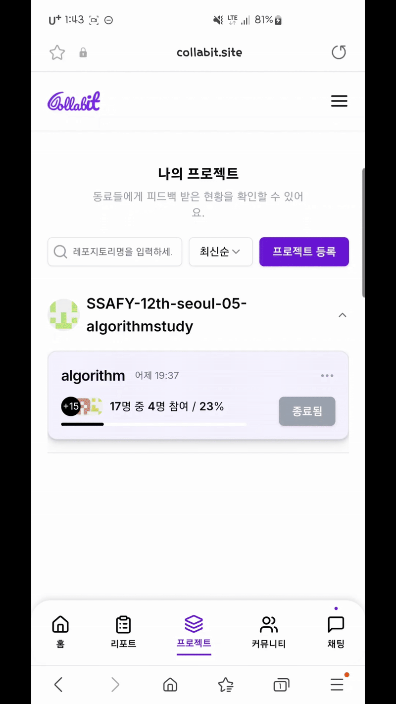
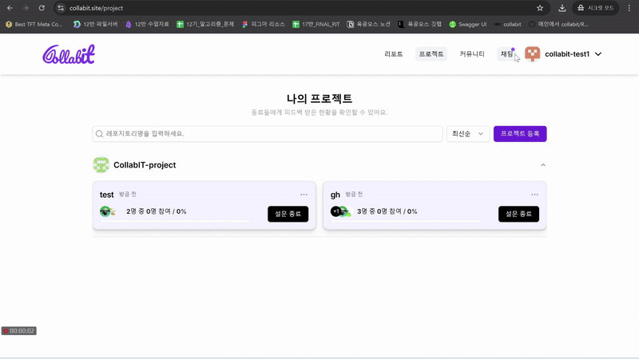
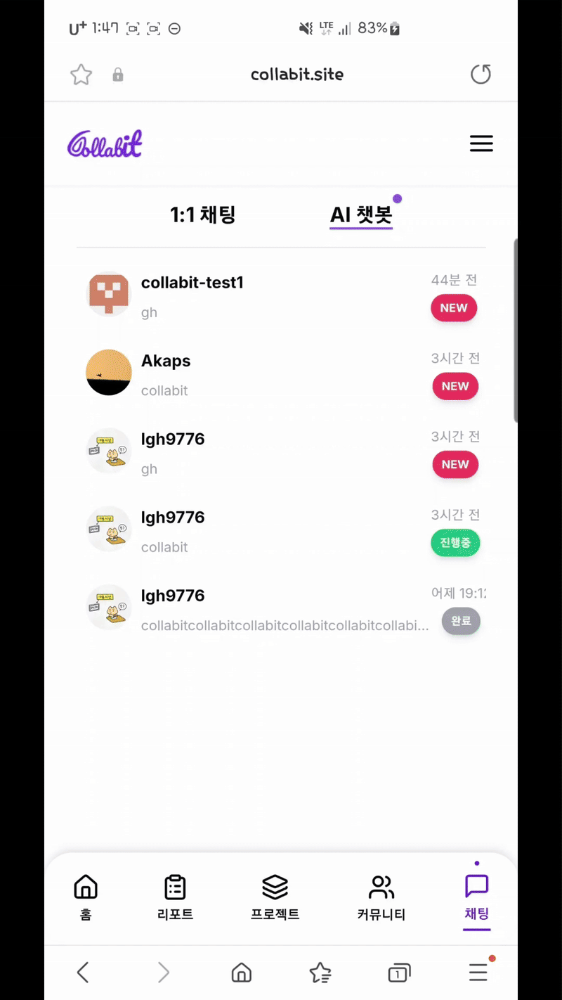
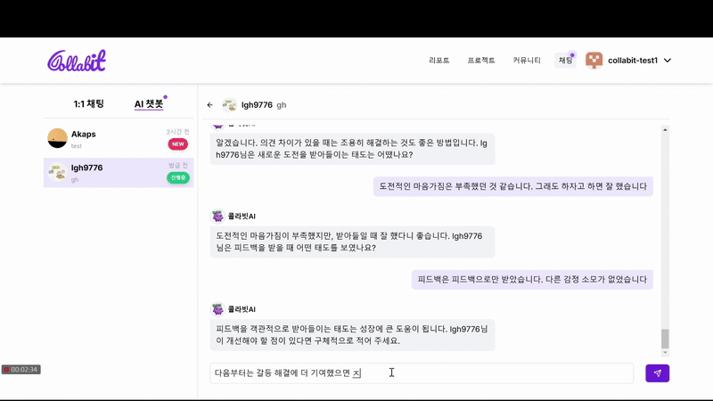
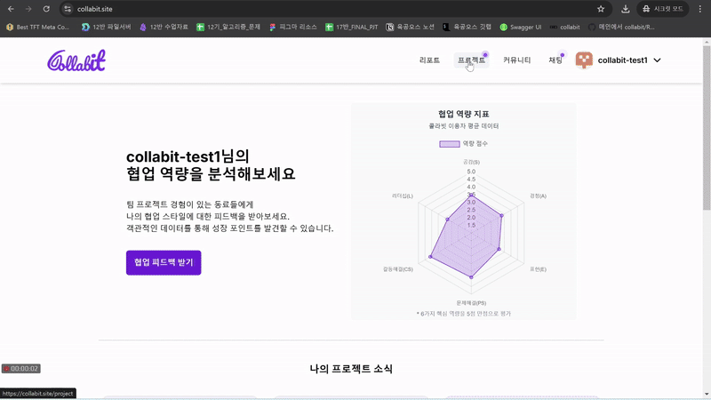
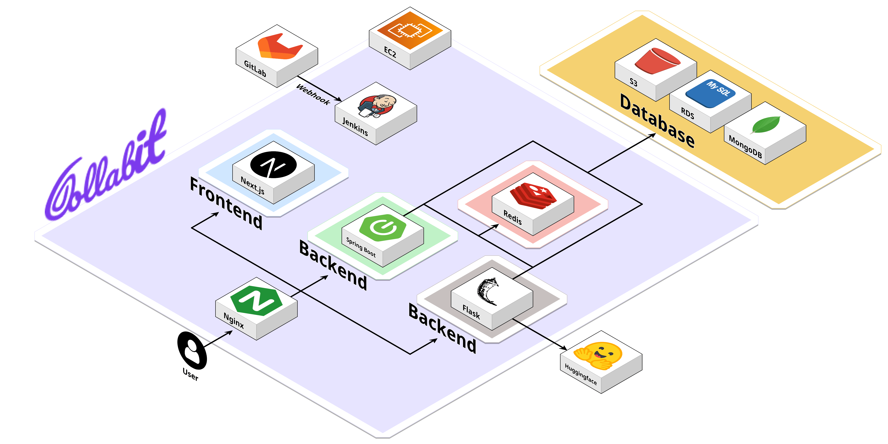

  

# 협업능력 피드백 플랫폼  
**동료들의 솔직한 피드백으로 나의 강약점을 발견하고 평균치와 비교하여 구체적인 성장 방향을 찾아보세요!**  

 

## ✨ 프로젝트 개요  
- **Collabit**은 팀원 간 협업 경험을 바탕으로 피드백 데이터를 수집하고,  
🤖 AI 기반으로 분석하여 개인화된 협업능력 평가를 제공합니다.  

🎯 **주요 대상**
- 자신의 강약점 파악을 힘들어하고, 프로젝트 후 팀원들의 피드백을 받아보고 싶은 **IT분야 취업 준비생** 

🌱 **확장 목표**
- 기업 채용 프로세스와 연계 가능  

 

## 🏆 핵심 기능 (MVP)  

### 1️⃣ GitHub API 연동: 실제 프로젝트 기반 설문 요청  
- 새로운 프로젝트를 등로하면 해당 유저들에게 설문이 요청됩니다.
- 프로젝트 리스트에서는 설문 링크를 복사해 공유할 수 있고, 설문 종료를 시킬 수 있습니다.

  
  

### 2️⃣ AI 챗봇을 활용한 주관식 설문 & 논문 기반 객관식 설문
- 채팅 페이지의 프로젝트에서 객관식 및 주관식 설문을 진행하실 수 있습니다.
- 설문에 참여하면 해당 유저의 프로젝트 설문문 참여자수가 증가합니다

  
  
  

### 3️⃣ 리포트를 통한 설문 결과 시각화 & AI 기반 요약 분석  
📄 PDF 추출 및 공유 기능 제공  
- 리포트 생성을 위해서는 프로젝트 페이지에서 설문을 마감해야 합니다.
- 마감된 프로젝트가 존재하고 3명 이상 참여했다면 리포트를 생성할 수 있습니다.
- 리포트 생성을 마치면 우측 상단 버튼을 통해 링크를 공유하거나 PDF를 받을 수 있습니다.
- 마감된 프로젝트가 추가된경우 우측 상단 리프레시 버튼을 통해 리포트 재생성이 가능합니다.

  
  

 

## ⚡ 주요 기능  
✔ **피드백 수집:** 프로젝트 팀원에게 객관식/주관식 설문 요청  
✔ **AI 기반 분석:** LLM을 활용한 답변 분석으로 강점/약점 도출  
✔ **맞춤형 리포트:** 협업능력 수치화 & 그래프 시각화  
✔ **실시간 피드백 시스템:** 즉시 데이터 수집 및 결과 확인 가능  
✔ **커뮤니티 & 채팅 기능:** 1:1 채팅 및 게시판 제공  

 

## 🐣 아키텍처

  

 

## 👥 팀원 소개  
<table>
  <tr>
    <td align="center"></td>
    <td align="center"></td>
    <td align="center"></td>
    <td align="center"></td>
    <td align="center"></td>
  </tr>
  <tr>
    <td align="center"><a href="https://github.com/seon318">정은선</a>  BE, FE </td>
    <td align="center"><a href="https://github.com/kimsz123456">김지승</a>  BE, Infra</td>
    <td align="center"><a href="https://github.com/clapsheep">박수양</a>  FE</td>
    <td align="center"><a href="https://github.com/seulgi980">한슬기</a>  BE</td>
    <td align="center"><a href="https://github.com/lgh9776">이가현</a>  BE</td>
  </tr>
  <tr>
  <td align="center">Chat   Project   Profile,   Report</td>
  <td align="center">Community   AI   Infra   Report</td>
  <td align="center">Auth   Community   Survey   Report</td>
  <td align="center">Auth   Report   Survey   User</td>
  <td align="center">OAuth   Project   Profile   Survey</td>
  </tr>
</table>

 

## 🛠 기술 스택  

### 🎨 Front-end  

### 🏗 Back-end  

### 📡 Infra  

### 📊 Data Visualization  

---

## 🔗 협업 방식  

### 🌿 브랜치 전략  
🚀 **Git Flow 전략** 기반 운영  
- `main` : 배포 가능한 최신 버전  
- `develop` : 개발된 기능 병합 브랜치  
- `feature` : 새로운 기능 개발 브랜치  
- `release` : 배포 전 QA 브랜치  
- `hotfix` : 긴급 수정 브랜치  

### 📌 커밋 컨벤션  
- `feat`: 새로운 기능 추가  
- `fix`: 버그 수정  
- `docs`: 문서 수정  
- `style`: 코드 스타일 변경  
- `refactor`: 코드 리팩토링  
- `test`: 테스트 코드 추가 및 수정  
- `chore`: 빌드 및 패키지 관리 수정  

---

 
💜 **Collabit과 함께 협업 능력을 성장시켜보세요!** 🚀  
